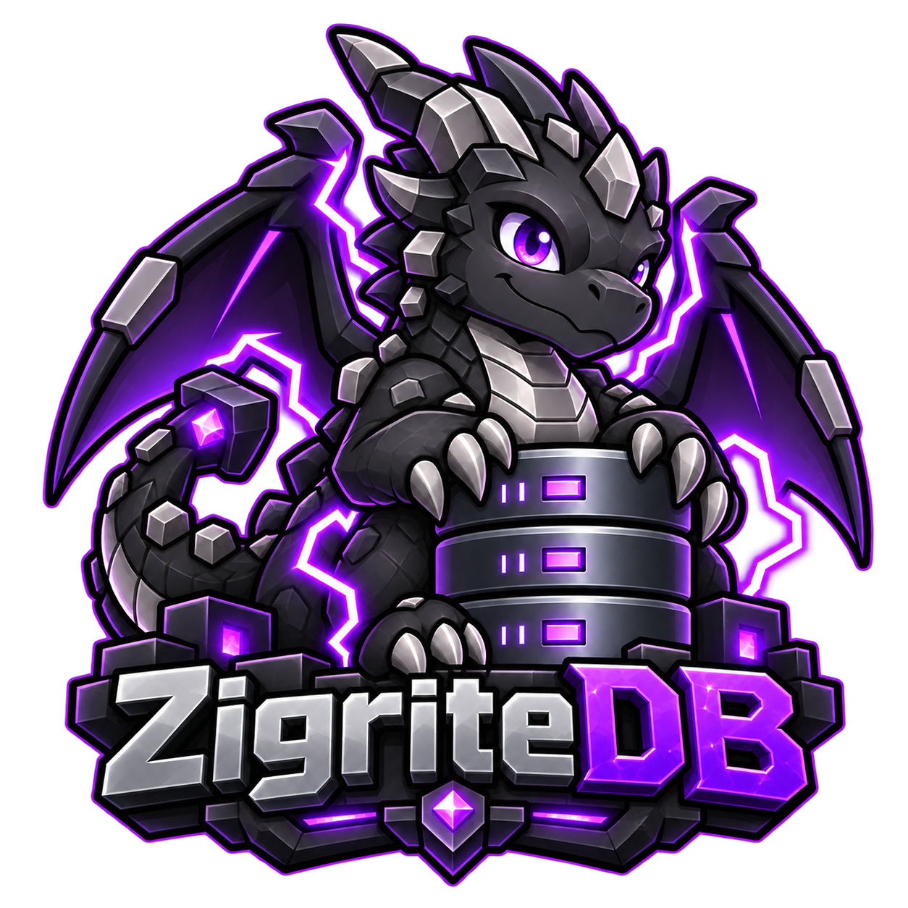

<p align="center">
  
</p>

<p align="center">
  Embedded world storage built for fast chunk saves and reads.
</p>

ZigriteDB is an embedded storage engine for Minecraft Bedrock worlds, written
in Zig and built for [Quark](https://github.com/Bedrock-Phanatics/Quark).
Append-only writes, batched saves, indexed reads, and LZ4 compression keep
storage focused on individual chunk components.

**In development.** The API and file format may change. Not yet recommended
for production worlds.

## Build

Requires **Zig 0.16.0** and **Linux** for storage operations.

```sh
zig build -Doptimize=ReleaseSafe
```

## Zig API

Place a checkout at `vendor/zigritedb` and add this to your application's
`build.zig`, using its existing `exe`, `target`, and `optimize`:

```zig
exe.root_module.addImport("zigritedb", b.createModule(.{
    .root_source_file = b.path("vendor/zigritedb/src/root.zig"),
    .target = target,
    .optimize = optimize,
}));
```

Create a `world` directory, then save and read a component:

```zig
const std = @import("std");
const db = @import("zigritedb");

pub fn main() !void {
    const allocator = std.heap.page_allocator;
    var threaded = std.Io.Threaded.init(allocator, .{});
    defer threaded.deinit();
    const io = threaded.io();

    const dir = try std.Io.Dir.cwd().openDir(io, "world", .{});
    defer dir.close(io);
    var world = try db.World.open(allocator, io, dir, .{});
    defer world.deinit();

    const key: db.Key = .{
        .dimension = 0,
        .chunk_x = 4,
        .chunk_z = 8,
        .component = .metadata,
    };
    const last_id = (try world.lastBatchId(key.region())) orelse 0;
    const data = "chunk data";
    _ = try world.write(.{ .entries = &.{.{
        .key = key,
        .header = .{
            .kind = .put,
            .batch_id = try std.math.add(u64, last_id, 1),
            .stored_len = data.len,
            .raw_len = data.len,
        },
        .value = data,
    }} });

    var buffer: [64]u8 = undefined;
    const saved = (try world.get(key, &buffer)) orelse return error.NotFound;
    std.debug.print("{s}\n", .{saved});
    try world.close();
}
```

Batches are atomic within one 32×32 chunk region and use increasing IDs.
Writes sync by default; buffered writes require a successful flush for durability.
Call `close` to flush and report errors; `deinit` only releases resources.
See [World](src/world/world.zig) for the full Zig API.

For other languages, link against `libzigritedb_native` and use
[zigritedb.h](include/zigritedb.h). Libraries and headers are installed under
`zig-out/lib` and `zig-out/include`.

The C ABI is versioned by `ZG_ABI_VERSION`, which must equal `zg_abi_version()`.
v0.3.0 is ABI 2: `zg_options` grew, so programs built against an ABI 1 header must be
rebuilt. On Linux the soname is `libzigritedb_native.so.2`, so ABI 1 binaries will not
load it, and `zg_open` rejects a mismatched `version`/`struct_size` before reading the rest.

## Benchmarks

```sh
zig build bench -Doptimize=ReleaseSafe
python3 tests/bench/run.py --directory /path/to/benchmark/filesystem
```

Outputs synthetic latency, memory, and storage measurements as JSON.
Compare equivalent workloads and durability settings.

## Testing

```sh
zig build test
zig build test -Doptimize=ReleaseSafe
zig build fuzz --fuzz=10000
```

Native fault and workload checks live in [tests/native](tests/native).
See [CI](.github/workflows/ci.yml) for the full verification commands.

## License

See [LICENSE](LICENSE).
